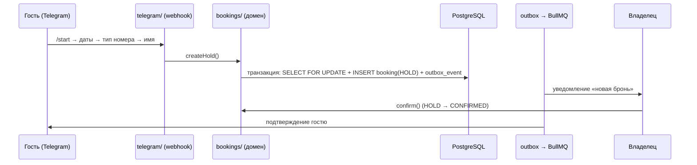

# NomadCore — Дизайн-документ

> Версия: 1.0 · Дата: 23.07.2026 · Автор: Тимур Кадырбеков
> Статус: актуализирован под переписывание на стек NestJS / Prisma / Nuxt (Фазы 0.1–0.2)

---

## 1. Обзор и цели

**NomadCore** — B2B2G-инфраструктура для туристической отрасли Кыргызстана: supply/data-слой, через который средства размещения (отели, гостевые дома) управляют инвентарём, ценами и бронями, а в перспективе — раздают их в OTA и государственные платформы.

**Главный принцип (value-first):** сначала реальная польза бизнесу — убрать овербукинг, ручное дублирование и бумажную тетрадку. Клиенты оцифровываются сами, потому что им удобно. Гос-модули, витрина и парки наслаиваются ПОВЕРХ уже принятого supply-слоя.

**Что НЕ является целью текущей фазы:**
- Маркетплейс / B2C-витрина (Фаза 2)
- Дашборды для государства и реестр размещений (Фаза 1)
- Билеты в парки, эко-сбор (Фаза 3)
- Интеграция с Tunduk Travel (направление закрыто 22.07.2026; эксклюзивность больше не условие движения)

**Стратегический контекст:** проект переосмысляется как предложение для прямой коллаборации с ГАРТ КР (Эдуард Кубатов). Меморандум с Фондом развития туризма — рычаг go-to-market для полевой оцифровки.

---

## 2. Продуктовые фазы (дорожная карта)

| Фаза | Содержание | Статус |
| --- | --- | --- |
| **0.1 «Тетрадка» (PMS-lite)** | Номера, календарь, брони, гости, анти-овербукинг, offline-first, ky/ru | ✅ Реализовано (Sprint 0–3) |
| **0.2 Бот + подписка** | Telegram-бот бронирования, уведомления, FREE/PRO-гейтинг | ✅ MVP (Sprint 4); ⏳ WhatsApp, оплата (Элсом/O!Деньги/MBank) |
| **1. Данные для государства** | Дашборд турпотока, реестр/классификация размещений | Не начато |
| **2. Витрина туристу** | Маркетплейс «Visit Kyrgyzstan» поверх того же supply | Не начато |
| **3. Гос-объекты** | Билеты в парки (пилот Ала-Арча), эко-сбор Иссык-Куль, пермиты, гиды | Не начато |

Каждая следующая фаза продаётся легче, потому что снизу уже есть принятая платформа и живые данные.

---

## 3. Архитектура системы

### 3.1 Стек

- **Backend:** NestJS 10 (TypeScript), модульная архитектура
- **ORM:** Prisma 5 + PostgreSQL 16
- **Кэш / очереди:** Redis 7 + BullMQ
- **Frontend:** Nuxt 3 (Vue 3, PWA), Dexie (IndexedDB) для offline, i18n ky/ru
- **Монорепо:** pnpm workspaces (`apps/api`, `apps/web`)

### 3.2 Компоненты (NestJS-модули)

```
apps/api/src/
  auth/           OTP (stub → SMS-провайдер КР) + JWT
  properties/     объекты размещения (timezone Asia/Bishkek на объекте)
  room-types/     типы номеров и цены
  rooms/          физические номера
  guests/         гости и контакты
  bookings/       доменное ядро: статусная машина + анти-овербукинг
  availability/   сетка «номер × дни» для календаря
  outbox/         transactional outbox + BullMQ-релей
  notifications/  воркер уведомлений поверх outbox
  telegram/       webhook + чистая диалоговая машина бота
  billing/        подписка FREE/PRO, гейтинг автоматизации
  common/         Prisma, health-check

apps/web/         Nuxt PWA: Сегодня / Календарь / Номера / Гости / Настройки
```

### 3.3 Поток данных (бронь через бота)



---

## 4. Ключевые архитектурные решения (ADR)

### ADR-1. Анти-овербукинг
**Проблема:** Prisma не поддерживает `FOR UPDATE` из коробки — главный риск переноса с Java/Spring.
**Решение:** интерактивная транзакция `isolationLevel: Serializable` + `$queryRaw` `SELECT ... FOR UPDATE` по строке номера + ретраи при serialization failure (P2034/40001). Колонка `version` — оптимистичный лок для офлайн-синхронизации.
**Инвариант:** при N конкурентных бронях одного номера на пересекающиеся даты проходит ровно одна (закреплено интеграционным тестом `test:races`).

### ADR-2. Даты и интервалы
Даты хранятся как `@db.Date`; брони — полуинтервалы `[checkIn, checkOut)`, поэтому back-to-back брони не конфликтуют. Таймзона объекта хранится в `Property.timezone` (по умолчанию `Asia/Bishkek`).

### ADR-3. Статусная машина брони
`HOLD → CONFIRMED → (CANCELLED)` — явные переходы с guard'ами, статусы в БД. Один и тот же доменный путь для UI и бота (бот не имеет «своего» пути записи).

### ADR-4. Transactional Outbox
Событие пишется в `outbox_events` в той же транзакции Prisma, что и изменение состояния. Релей (BullMQ) публикует события с `jobId = id события` (идемпотентность), воркер рассылает уведомления. Атомарность «состояние + событие» — обязательное условие согласованности.

### ADR-5. Offline-first
Dexie (IndexedDB): кэш GET-ответов + очередь мутаций, проигрываемая при появлении сети. Конфликты: last-write + `version`. Обоснование: целевые клиенты — гостевые дома в регионах с нестабильной связью, дешёвые Android-устройства.

### ADR-6. Монетизация (красная линия)
**Бесплатно всегда:** базовый учёт, календарь, ручные брони, анти-овербукинг, offline — это крючок adoption, ломать его нельзя.
**Pro (подписка ~990 КГС/мес, гипотеза):** только автоматизация — бот, авто-подтверждения/напоминания, приём предоплаты, синхронизация с OTA, аналитика. Модель цены (фикс / pay-per-booking / гибрид) проверяется на пилоте.

### ADR-7. Auth
OTP по телефону (stub-режим: код в логах/ответе), JWT-сессии. SMS-провайдер КР подключается заменой `OTP_MODE` без изменения кода.

---

## 5. Модель данных

Ядро (Prisma, `apps/api/prisma/schema.prisma`): `Property` (объект, timezone) → `RoomType` (цены) → `Room` → `Booking` (статусная машина, `[checkIn, checkOut)`, `version`); `Guest` (контакты); `OutboxEvent`; подписка/тариф на `Property` (FREE/PRO). Миграции — Prisma Migrate; seed — демо-объект «Ак-Кеме».

---

## 6. Telegram-бот (Фаза 0.2, MVP)

**Сценарий:** `/start` → даты (`10.08-13.08`) → выбор типа номера → имя → HOLD-бронь (тот же анти-овербукинг-путь) → уведомление владельцу → подтверждение в приложении → подтверждение гостю.

**Технически:** webhook `POST /api/telegram/webhook` (секрет `TELEGRAM_WEBHOOK_SECRET`); диалоговая машина — чистая функция (юнит-тесты без сети); `TELEGRAM_MODE=stub` для разработки.

**Упрощения MVP → следующая итерация:**
- один объект на бота → мультитенантность через deep-link `/start <propertyCode>`
- in-memory сессии → Redis
- привязка владельца `/owner <телефон>` → через OTP

---

## 7. Нефункциональные требования

| Требование | Решение |
| --- | --- |
| Работа без сети | PWA + Dexie, очередь мутаций |
| Дешёвый Android | лёгкий фронт, минимум полей |
| Языки | ky/ru (i18n), фразы саппорта двуязычные |
| Целостность броней | Serializable-транзакции, тест гонок |
| Надёжная доставка событий | outbox + идемпотентный релей |
| Нагрузка чтения | Redis-кэш доступности/цен с инвалидацией при изменении инвентаря |

---

## 8. Риски

1. **Prisma и блокировки** — закрыт ADR-1, но требует прогона `pnpm test:races` на реальной БД после `pnpm install` (код писался без npm registry).
2. **Атомарность outbox** — событие и состояние строго в одной транзакции; любой обход ломает гарантии.
3. **Платёжные провайдеры КР** (Элсом/O!Деньги/MBank) — не выбраны; блокирует приём предоплаты в Pro.
4. **WhatsApp-канал** — дороже и регуляторно сложнее Telegram; отложен до выбора провайдера.
5. **Спрос ≠ витрина** — Фаза 0 сознательно не обещает «приведём гостей»; ценность — порядок. Смешение обещаний ломает позиционирование.
6. **Go-to-market** — экономика полевой оцифровки (CAC ~700 КГС/объект, конверсия ~35%, LTV/CAC ~11–12x) — гипотезы; проверяются пилотом (Каракол/Иссык-Куль, 200–300 объектов, 2–3 агента).

---

## 9. Открытые вопросы

- Выбор платёжного провайдера (Элсом / O!Деньги / MBank) и модель цены Pro (фикс / % / гибрид).
- SMS-провайдер для боевого OTP.
- Мультитенантность бота (deep-link + Redis-сессии) — когда именно тянуть в MVP.
- Формат коллаборации с ГАРТ КР / Кубатовым и роль меморандума в пилоте.
- Держатель мандата на парки/эко-сбор (актуально только к Фазе 3).

---

## 10. Критерии успеха пилота (Фаза 0)

- 200–300 объектов оцифровано за ~1.5–2 месяца.
- ≥50% объектов активны через месяц после онбординга.
- ≥30% на платной подписке бота.
- Первые реальные брони, принятые через бота.
- Ноль зафиксированных овербукингов у активных клиентов.
